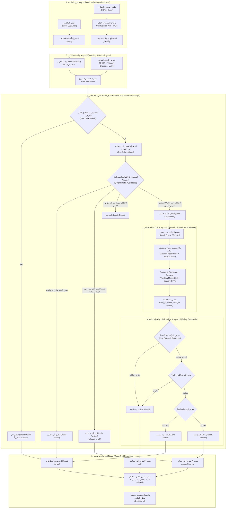
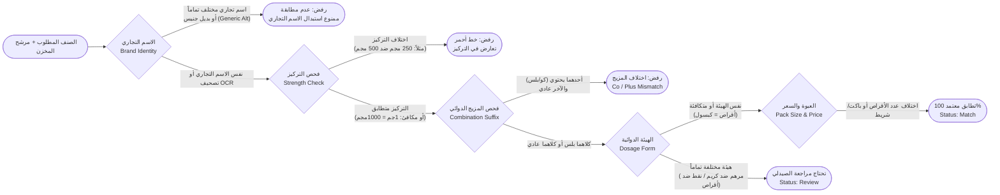

# نظام مطابقة نواقص الأدوية الذكي — Pharmacy Intelligent Matcher
## المخطط المعماري الشامل وشجرة اتخاذ القرار (System Architecture & Decision Graph)

---

## 1. نظرة عامة على النظام (System Overview)

نظام هجين فائق الدقة والسرعة مخصص للصيدليات والشركات الطبية، يقوم بمطابقة طلبات وقوائم نواقص الأدوية (Shortages) الواردة بصيغ متعددة (Excel / PDF) مع عروض وقوائم مخازن الأدوية والموزعين (Warehouse Catalogs).

يعتمد النظام على **هيكلية متدرجة متعددة المستويات (Multi-Tier Decision Pipeline)** تجمع بين:
1. **الفهرسة الحتمية والبحث الدلالي السريع (TF-IDF & N-Gram Search)** في أجزاء من الثانية.
2. **القواعد الصيدلانية الصارمة (Deterministic Pharmaceutical Rules)** التي تمنع أي تداخل دوائي أو خطأ علاجي.
3. **الذكاء الاصطناعي التوليدي الصيدلاني (Gemini 3.8 Flash)** عبر دفعات مجمعة (Batch Processing) لمعالجة التصحيف اللغوي وتشوهات الـ OCR المعقدة.
4. **حواجز الأمان الصيدلاني البعدية (Safety Guardrails)** لضمان صفر أخطاء تجارية (Zero False Positives).

---

## 2. المخطط المعماري العام للنظام (System Architecture)

---

## 3. شجرة اتخاذ القرار الصيدلاني بالتفصيل (Detailed Decision Logic)

---

## 4. القواعد الحاكمة الخمسة (The 5 Core Pharmaceutical Rules)

| # | القاعدة الصيدلانية | الوصف والأمثلة | القرار الناتج |
| :---: | :--- | :--- | :---: |
| **1** | **التركيز خط أحمر (Zero Tolerance)** | ممنوع منعاً باتاً مطابقة تراكيز مختلفة حتى لنفس الدواء (نوفاكس 250 ضد نوفاكس 500). ويُقبل التكافؤ العلمي فقط ($1\text{ gm} = 1000\text{ mg}$ أو $0.5\text{ gm} = 500\text{ mg}$). | **رفض (No Match)** |
| **2** | **حظر البدائل الجنيسة (Brand Integrity)** | لا يجوز استبدال براند تجاري ببراند تجاري آخر ولو تطابقت المادة الفعالة (مثل بنادول ضد سيتال، أو بروتولوك ضد كونترولوك). | **رفض (No Match)** |
| **3** | **المزيج الدوائي المزدوج (Co / Plus)** | وجود لاحقة (كو / بلس / بلاس / كومب / Co / Plus) يعني دواءً مركباً من مادتين، فلا يطابق الصنف المفرد (أتاكاند ضد أتاكاند بلس). | **رفض (No Match)** |
| **4** | **اختلاف الهيئة الدوائية (Dosage Form)** | إذا تطابق الاسم التجاري والتركيز واختلفت الهيئة (مرهم ضد كريم، أو نقط ضد أقراص، أو شراب ضد أقراص)، تُحال الحالة للصيدلي ليقرر حسب الروشتة. | **يحتاج مراجعة (Review)** |
| **5** | **حجم العبوة والسعر (Packaging & Lot Size)** | اختلاف عدد الأقراص (20 ضد 30 قرص)، أو عدد الشرائط، أو مسميات الجملة (باكت، باكو، كرتونة)، أو مؤشرات السعر (س.ج / سعر جديد) لا يؤثر على التطابق إطلاقاً. | **تطابق تام (Match)** |

---

## 5. ميزات الأداء والتشغيل الفعلي (Runtime Metrics)

* **سرعة فائقة:** معالجة ملفات النواقص التي تتجاوز **1,000 صنف** ضد **6 مخازن (أكثر من 2,700 صنف)** في حوالي **6 إلى 8 دقائق** فقط.
* **دفعات عملاقة (Batch Processing):** إرسال **75 صنفاً في الطلب الواحد** إلى Gemini 3.8 Flash مع الاستجابة الكاملة في حوالي 25 ثانية.
* **أعلى معايير الأمان (Thinking: High):** تشغيل نمط التفكير المعمق لتحليل أخطاء الـ OCR والتصحيف الشديد، مع إيقاف البحث الخارجي (Search OFF) لمنع أي تشتيت للنموذج.
* **تقارير إكسيل تنفيذية:** فصل كامل بين المطابقات المؤكدة لكل مخزن، وشيت مستقل للمراجعة يحتوي على قائمة منسدلة، وشيت للأصناف المفقودة، وملخص ديناميكي شامل بالمعادلات الحسابية.
