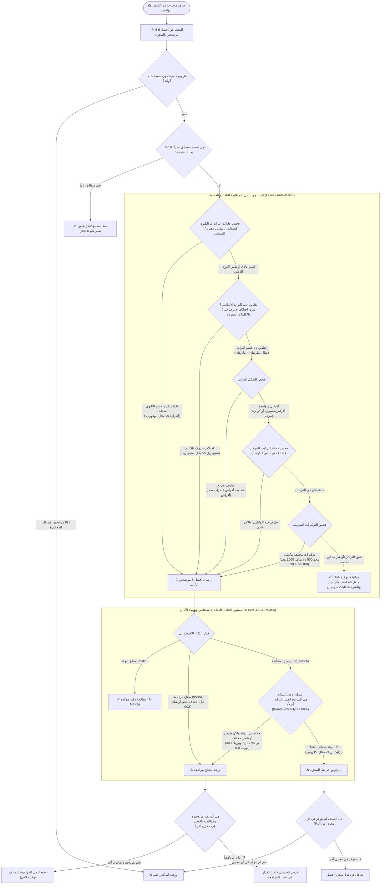

# مخطط شجرة القرار الهندسية لمطابقة الأدوية (Decision Graph)

يوضح هذا المستند المسار الكامل الذي يمر به أي صنف مطلوب (من كشف النواقص) أمام أصناف المخازن الستة للوصول إلى النتيجة الصحيحة: **(مطابقة مؤكدة - يحتاج مراجعة - لم يُعثر عليه)**.

---

## 1. المخطط الانسيابي الشامل (Mermaid Flowchart)

---

## 2. تفصيل بوابات الفحص (Safety Gates)

| البوابة | شرط النجاح للمطابقة التلقائية | شرط التحويل للمراجعة / الـ AI | أمثلة حقيقية من كشوفاتك |
| :--- | :--- | :--- | :--- |
| **1. عائلات البراندات** | تطابق الاسم الثانوي بالكامل | وجود كلمة عامة مع اختلاف النوع | `إنسولين نوفورابيد` ضد `إنسولين أكترابيد` $\rightarrow$ تذهب للمستوى 3 فوراً |
| **2. تطابق البراند** | تطابق بنسبة 100% للكلمة المفردة | اختلاف حرف واحد في الكلمات القصيرة | `سينوبريت` ضد `سينوبريل` $\rightarrow$ تُرفض من المطابقة التلقائية |
| **3. الشكل الدوائي** | توافق طبي كامل (أقراص/كبسول، كريم/مرهم) | نقط ضد أقراص، أو شراب ضد أقراص | `كتافلام نقط` ضد `كتافلام 50 أقراص` $\rightarrow$ تُمنع من التطابق التلقائي |
| **4. لواحق التركيب** | كلاهما يحتوي `كو/بلس` أو كلاهما عادي | أحدهما `كو/بلس` والآخر عادي | `سينوبريل كواقراص` ضد `سينوبريل عادي` $\rightarrow$ تُمنع من التطابق التلقائي |
| **5. التركيزات** | تطابق الأرقام والوحدات | أرقام مختلفة صراحة (1جم vs 500) | `سيتال 1جم` ضد `سيتال 500` $\rightarrow$ تُمنع وتذهب لمراجعة الصيدلي |
| **6. العبوة والتغليف** | **يُسمح بالتطابق دائماً** | لا يحول للمراجعة | `زنكترون 30 كبسولة` = `زنكترون باكت 160 قرص` $\rightarrow$ مطابقة تامة |
| **7. شبكة أمان الرفض** | دواء مختلف كلياً $\rightarrow$ رفض نهائي | نفس البراند مع فارق تركيز أو خطأ OCR | `نويوريك 300` ضد `نو-يوريك 100` $\rightarrow$ مراجعة وليس "لم يُعثر عليه" |
