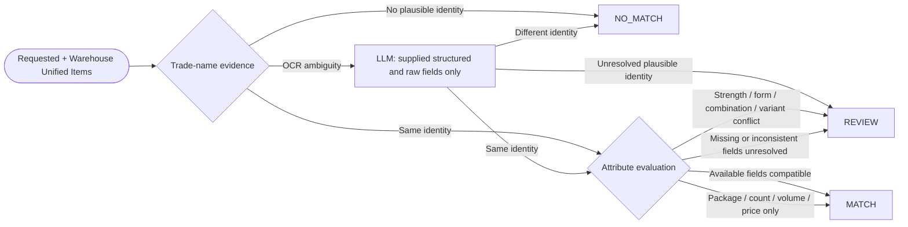

# نظام مطابقة نواقص الأدوية الذكي بالرؤية البصرية — Pharmacy Vision Matcher
## المخطط المعماري الشامل وشجرة اتخاذ القرار (System Architecture & Decision Graph)

---

> تحديث معتمد — 2026-09-28: النظام يقيس وجود الصنف. `trade_name` المنظم هو مسار الاسترجاع الرئيسي، والاسم الخام fallback. بعد ثبوت/ترجيح الهوية، اختلاف التركيز أو الهيئة أو المزيج/المتغير يؤدي إلى REVIEW، وليس NO_MATCH. هذا التحديث يحل محل قاعدة رفض اختلاف التركيز السابقة. لا تتغير إعدادات Gemini أو MSEMAX.

## 1. نظرة عامة على النظام (System Overview)

نظام صيدلاني هجين فائق الدقة والسرعة، يقوم بمطابقة طلبات وقوائم نواقص الأدوية (Shortages) الواردة بصيغ متعددة (**Excel / Markdown / PDF**) مع عروض وقوائم مخازن الأدوية والموزعين (Warehouse Catalogs).

في هذه النسخة المطورة (`Pharmacy-agy-vision`)، تم الانتقال بالكامل من محركات الـ OCR التقليدية (`Unstructured.io`) إلى **محرك الرؤية البصرية الصيدلاني المتقدم (Google Gemini Vision)** الذي يعمل صفحة بصفحة (Page-by-Page Extraction) عبر بوابة محلية مخصصة (`MSEMAX-GAIStudio-vision` على المنفذ `8001`)، مما يضمن استخراج أسماء الأدوية العربية بنسبة دقة وسلامة إملائية 100%، مع بنية كاش واستئناف ذكي (Resumability) لكل عملية.

---

## 2. المخطط المعماري العام للنظام (System Architecture)

```mermaid
flowchart TD
    subgraph Ingestion["1. طبقة المدخلات والاستخراج متعدد الصيغ (Multi-Format Ingestion)"]
        F_EXCEL["ملفات إكسيل<br/>(.xlsx, .xls, .xlsm)"]
        F_MD["ملفات ماركداون<br/>(.md, .markdown)"]
        F_PDF["ملفات فواتير وقوائم PDF<br/>(1 إلى 30+ صفحة)"]
        
        F_EXCEL --> R_EXCEL["قارئ الإكسيل الذكي<br/>Auto-Detect Sheet & Drug Column"]
        F_MD --> R_MD["قارئ الماركداون<br/>Markdown Tables & Lists Parser"]
        F_PDF --> V_ENG["محرك الرؤية البصرية صفحة بصفحة<br/>Gemini Vision Extractor (pypdfium2 + WebP)"]
        
        subgraph VisionLifecycle["دورة حياة الرؤية البصرية والكاش المعزول"]
            V_ENG --> HASH["حساب البصمة الرقمية SHA-256"]
            HASH --> MANIFEST{"فحص مانيفست العملية<br/>(manifest.json)"}
            MANIFEST -- "الصفحات مكتملة سابقاً" --> INSTANT["تحميل فوري في 0.05 ثانية"]
            MANIFEST -- "صفحات ناقصة أو جديدة" --> RENDER["تحويل الصفحة لـ WebP عالية الدقة<br/>(Scale: 2.5 | Size: ~280KB)"]
            RENDER --> BASE64["تشفير Base64 وإرسال الطلب"]
            BASE64 --> GATEWAY["بوابة Google AI Studio Vision<br/>(Port: 8001 | gemini-3.8-flash)"]
            GATEWAY --> SAVE_PAGE["حفظ استجابة الصفحة page_N.json<br/>وتحديث المانيفست فورياً (استئناف تلقائي)"]
            SAVE_PAGE --> AGGREGATE["دمج أصناف جميع الصفحات"]
            INSTANT --> AGGREGATE
        end
        
        R_EXCEL & R_MD & AGGREGATE --> CLEAN_ITEMS["أصناف مع الحقول المتاحة دون فقد:<br/>item_name_raw / trade_name / strength / form / source_page / source_file"]
    end

    subgraph Preprocessing["2. الفهرسة والتقسيم الذكي (Indexing & Deduplication)"]
        CLEAN_ITEMS --> DEDUP["إزالة التكرار (Deduplication)<br/>أصناف فريدة للنواقص"]
        CLEAN_ITEMS --> INDEX["فهرس trade_name المنظم مع raw fallback<br/>Full-name evidence + TF-IDF للترتيب"]
        DEDUP & INDEX --> ENGINE["محرك التنسيق والمطابقة السريع<br/>FastCoordinator"]
    end

    subgraph DecisionGraph["3. شجرة وجود الصنف وتقييم الصفات"]
        ENGINE --> UNIFIED["Unified Item: raw_name + trade_name + strength + form + package + provenance"]
        UNIFIED --> CAND["Structured trade-name retrieval ثم raw-name fallback<br/>دمج المرشحين حسب row ID دون قطع صفوف الاسم عند Top-K"]
        CAND --> PRESENT{"هوية صنف معقولة؟"}
        PRESENT -- "لا" --> NO_M["NO_MATCH: لا مرشح لهوية الصنف"]
        PRESENT -- "نعم" --> L2{"هوية واضحة وصفات متوافقة؟"}
        L2 -- "نعم" --> M_AUTO["MATCH"]
        L2 -- "هوية واضحة مع تعارض صفات" --> FINAL_R["REVIEW: السبب والمرشح ظاهران"]
        L2 -- "OCR أو بيانات ناقصة" --> BATCH["Batch 75: structured item + raw evidence"]
        BATCH --> GAI["Gemini 3.8 Flash<br/>Thinking HIGH / Search OFF / Fresh Chat ON"]
        GAI --> GUARDS{"Python: candidate ID + identity evidence + attribute guards"}
        GUARDS -- "نفس الصنف والمتاح متوافق" --> FINAL_M["MATCH"]
        GUARDS -- "نفس الصنف مع تعارض أو نقص غير محسوم" --> FINAL_R
        GUARDS -- "رفض صريح لهوية OCR غير المطابقة فقط" --> NO_M
    end

    subgraph Outputs["4. طبقة المخرجات والواجهة (Excel & Desktop UI)"]
        FINAL_M & M_AUTO --> SH_WH["شيت لكل مخزن بالمطابقات المؤكدة"]
        FINAL_R --> SH_REV["شيت الأصناف التي تحتاج مراجعة الصيدلي"]
        NO_M --> SH_NF["شيت الأصناف التي لم يُعثر عليها"]
        SH_WH & SH_REV & SH_NF --> EXCEL["ملف إكسيل شامل متكامل<br/>+ شيت ملخص ديناميكي بالمعادلات الحسابية"]
        EXCEL --> APP["واجهة برنامج سطح المكتب المطور<br/>(Desktop App UI مع مزامنة كاملة للشاشات)"]
    end
```



---

## 3. تفاصيل دورة حياة الكاش والاستئناف (Resumability Lifecycle)

لكل ملف PDF تتم معالجته، يتم إنشاء مجلد كاش منظم ومنعزل تماماً داخل مجلد العملية:
`data/processes/PROC-XXX/cache/vision/<file_slug>_<hash[:10]>/`

```
📁 PROC-XXX/cache/vision/almaakromi_e3b0c44298/
├── 📄 manifest.json          # حالة العملية والصفحات المنتهية
├── 📁 pages/
│   ├── page_1.webp          # صورة الصفحة الأولى (WebP 85%)
│   ├── page_2.webp
│   └── page_3.webp
└── 📁 results/
    ├── page_1.json          # الأصناف المستخرجة من الصفحة 1
    ├── page_2.json
    └── page_3.json
```

### مزايا هذا التصميم المعماري:
1. **الاستئناف التلقائي (Resumability):** إذا احتوى ملف على 25 صفحة وتوقفت المعالجة عند الصفحة 12 (بسبب إغلاق المتصفح أو انقطاع الاتصال)، عند إعادة التشغيل يقرأ السيستم الـ `manifest.json` ويستأنف فوراً من الصفحة 13 دون تكرار الصفحات السابقة.
2. **التحميل الفوري (Zero-Token Reload):** إذا تم طلب نفس الملف مجدداً، يتم استرجاع كافة الأصناف من الكاش المحلي في 0.05 ثانية.
3. **نظافة تامة للمشروع:** منع وجود أي ملفات مؤقتة مبعثرة؛ كل عملية تحتوي على كاشها الخاص المنظم.

---

## 4. شجرة اتخاذ القرار الصيدلاني (Detailed Decision Tree)



---

## 5. القواعد الحاكمة الخمسة (The 5 Core Pharmaceutical Rules)

| # | القاعدة الصيدلانية | الوصف والأمثلة | القرار الناتج |
| :---: | :--- | :--- | :--- |
| **1** | **التركيز يمنع MATCH عند التعارض** | نفس هوية الصنف مع تركيزين واضحين مختلفين يظل FOUND ويذهب للمراجعة. التكافؤ مثل 1جم = 1000مجم مقبول. غياب التركيز ليس تعارضًا. | **Review** عند التعارض |
| **2** | **هوية الصنف** | لا بدائل جنيسة أو معلومات دوائية خارج البيانات. NO_MATCH يعني عدم وجود مرشح لهوية الصنف أو رفض هوية OCR صراحة؛ لا ينتج من نقص/تعارض الصفات. | **No Match** للهوية المختلفة |
| **3** | **المزيج والمتغير** | اختلاف Co / Plus أو رقم متغير حقيقي يمنع MATCH، مع إبقاء المرشح للمراجعة. أرقام العبوات لا تُعامل كمتغيرات. | **Review** |
| **4** | **الهيئة** | اختلاف هيئة نفس الصنف يذهب للمراجعة؛ الأقراص والكبسولات متوافقة حسب القاعدة القائمة. | **Review** عند الاختلاف |
| **5** | **العبوة والسعر** | العدد والشرائط والعبوة وحجمها فقط ومؤشرات السعر لا تمنع MATCH. | **Match** إذا بقية المعلومات المتاحة متوافقة |

الحقول المنظمة لا تُختزل إلى الاسم الخام قبل الفهرسة. يُستخدم parsing محلي للمدخلات الخام دون قاموس أدوية أو aliases. تبقى القيم غير المحسومة unknown، وتُحفظ اختلافات structured/raw كأسباب مراجعة. يظل فشل المزوّد خطأ تشغيل وليس نتيجة صنف.

---

## 6. ميزات الأداء وتحديثات الواجهة (UI & Performance Highlights)

1. **دعم متعدد الصيغ (Multi-Format Support):** قراءة تلقائية وتلقين مرن لملفات Excel و Markdown و PDF.
2. **محرك الرؤية البصرية المطور (Pure Vision):** التخلص التام من أخطاء الـ OCR والتصحيف، واستخراج أسماء الأدوية العربية والإنجليزية بدون تشويه.
3. **تزامن كامل لواجهة المستخدم (Navigation Sync):** معالجة زر الانتقال لشاشة الأوامر والـ Terminal، مع مزامنة القائمة الجانبية تلقائياً، والاحتفاظ بحالة التحميل للعمليات الجارية في الخلفية.
4. **شاشات سيرفرات متقدمة:** متابعة مباشرة لسيرفر `Google AI Studio Vision` على المنفذ `8001` مع فحص فوري للاتصال والتيرمينال التفاعلي.
